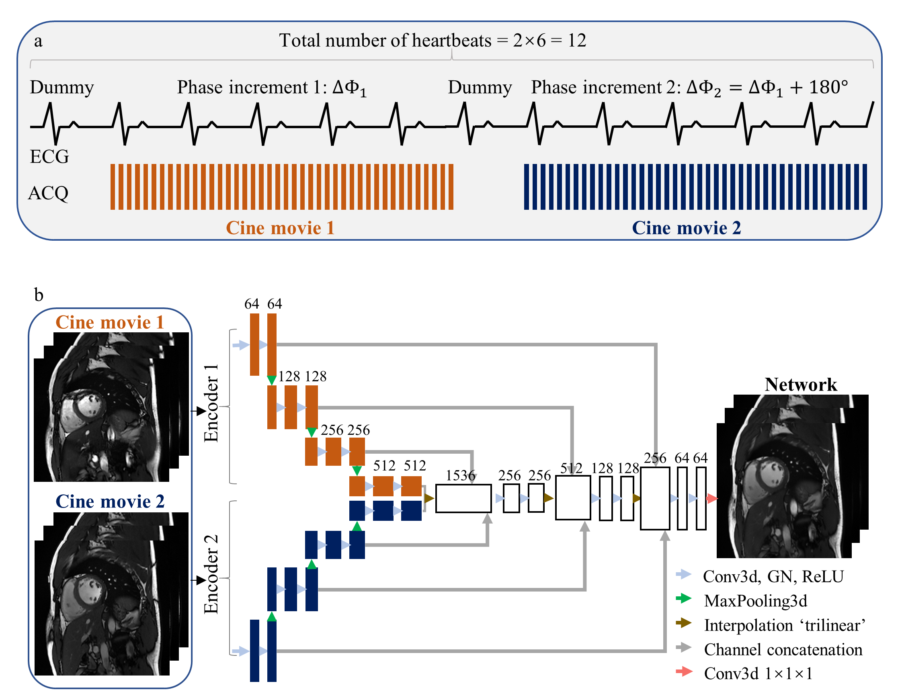

# Joint suppression of cardiac bSSFP cine banding and flow artifacts using twofold phase-cycling and a dual-encoder neural network

<picture>
 <source media="(prefers-color-scheme: dark)" srcset="image.png">
 <source media="(prefers-color-scheme: light)" srcset="image.png">
 
</picture>

## Abstract
**Background**  
Cardiac bSSFP cine imaging suffers from banding and flow artifacts induced by off-resonance. Although fourfold phase cycling suppresses banding artifacts, it invokes flow artifacts and prolongs the scan. The purpose of this work was to develop a twofold phase cycling sequence with a neural network-based reconstruction (2PC+Network) for a joint suppression of banding and flow artifacts in cardiac cine imaging.  
**Methods**  
A dual-encoder neural network was trained on 1620 pairs of phase-cycled cine images from 18 healthy subjects. Twenty healthy subjects and 10 patients were prospectively scanned using the proposed 2PC sequence. Regular cine (bSSFP), regular cine with a neural network-based artifact reduction (pure post-processing), regular 2PC which averages the two phase-cycled images (2PC), and the proposed method were comparison methods. To assess these methods, artifact suppression on short-axis left-ventricular cine images, generalizability over altered scan parameters and scanners, and large-area banding artifact suppression on transversal left-atrium (LA) cine images were evaluated.   
**Results**  
Quantitative evaluations showed that 2PC+Network was robust against shifts of the off-resonance regions. Compared to bSSFP and 2PC, the proposed method improved banding artifacts (3.85±0.67 and 4.50±0.45 vs 5.00±0.00, p<0.01 and p=0.02), flow artifacts (3.35±0.78 and 2.10±0.77 vs 4.90±0.20, both p<0.01), and overall image quality (3.25±0.51 and 2.30±0.60 vs 4.75±0.25, both p<0.01). Although both the post-processing and 2PC+Network achieved similar artifact suppression, the latter achieved better authenticity (two-chamber, 4.60±0.62 vs 3.55±0.65, p<0.01; four-chamber, 3.90±0.73 vs 3.15±0.78, p=0.02; and LA, 4.70±0.33 vs 3.60±0.54, p<0.01) on cine movies with altered imaging views. In the pulmonary vein and LA, 2PC+Network significantly obtained a higher normalized average signal and lower coefficient of variation relative to bSSFP and post-processing, suggesting better suppression of large-area banding artifacts.  
**Conclusions**  
The proposed 2PC+Network method achieved a joint suppression of banding and flow artifacts and manifested a good generalizability against anatomical variations. It provides a robust and practical tool for the improvement of reliability in cardiac cine imaging.  

## Requirements
numpy==1.21.2  
opencv_python==4.5.1.48  
scipy==1.8.1  
torch==1.11.0  
torchvision==0.12.0  
## How to use
Details of the code are as follows:

(./train.py): To train the dual-encoder neural network.

> ./test.py: To test the dual-encoder neural network.

> ./data: It contains training data and testing data. Training data consists of bSSFP data with 12 different RF phase increments and corresponding labels.

> ./model: It contains trained model, which can be used in the testing process.

## How to cite this work
